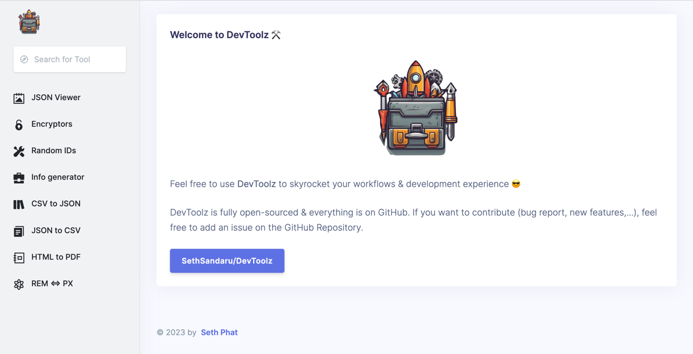

# The DevToolz Application

Opinionated DevToolz to increase/skyrocket the Development Experience (DX).
Built from personal preferences and experience.

I'm proud to use this every day and share it with the whole world under OSS aura 🥰🚀. 

No ADS, no tracking, OnlyTools 👀

Live at: [https://tools.sethphat.dev/](https://tools.sethphat.dev/) 😎

## DevToolz built from
- Vue 3 x TypeScript
- PHP 8.2
- Laravel 10

## Available Toolz

- 😎 Minimalism JSON Viewer (with Tabs view) 
- 🔥 Encryptor: MD5, SHA1, SHA256, Base64 & Hex
- 💪 Random IDs: UUID, UUIDv4, ULID
- ⚒️ Fake info generator (name, address, phone number,...)
- 🟡 HTML to PDF
- 🟡 CSV to JSON
- 🟡 JSON to CSV
- 🟡 Web Development Helpers:
  - 🟡 PX to REM and vice-versa
  - 🟡 WebP converter

Notes: 🟡 in development / coming soon!

## Self-hosted / Local

### Requirements
- [Composer](https://getcomposer.org/)
- Node 18+

### Setup

- Clone this repo
- Run `composer install`
- Copy `.env.example` => `.env`
- Run `php artisan key:generate`
- Run `npm ci && npm run build`
- Run `php artisan octane:start` to start the application

### Self-hosted

You'd need NGINX for reverse-proxy purpose.

## License
MIT License

## Motivation

> Unlike DevUtils that you have to pay every year and the maker doesn't really listen to the audience 😡

These DevToolz are simple, easy to implement and yet helpful and should be open-sourced, shared to the whole
dev community.

## Contribution

Feel free to submit your idea (over an Issue) or your Feature PR. 

We'd love to have more and more tools under DevToolz 🚀.

## Copyright

Copyright ©️2023 by Seth Phat.
